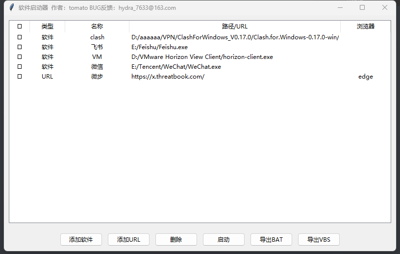
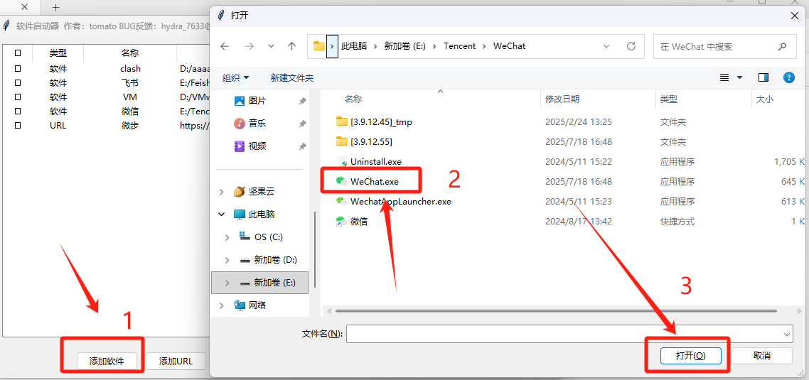
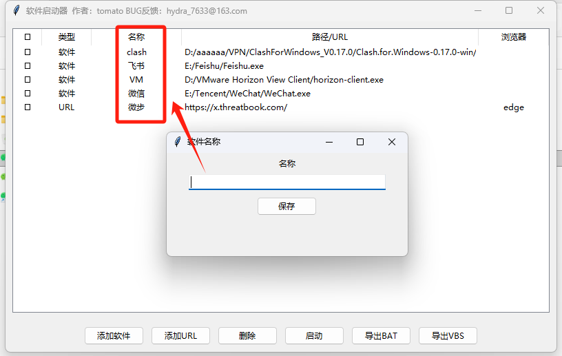
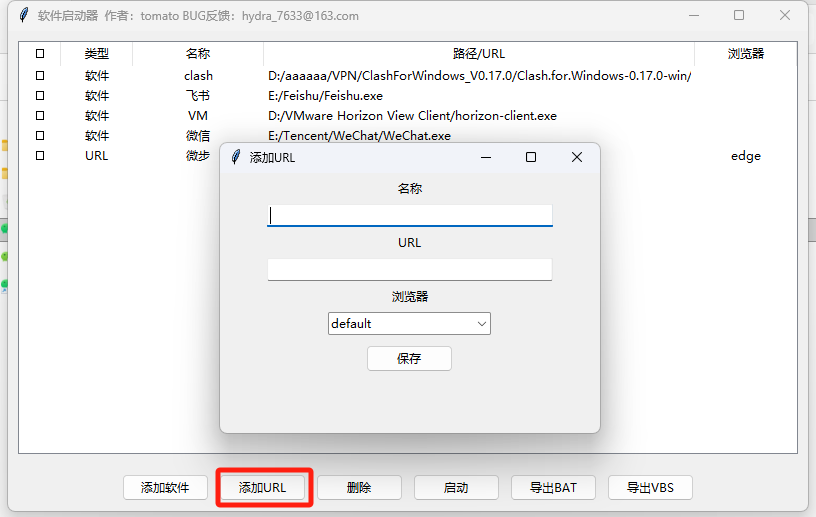
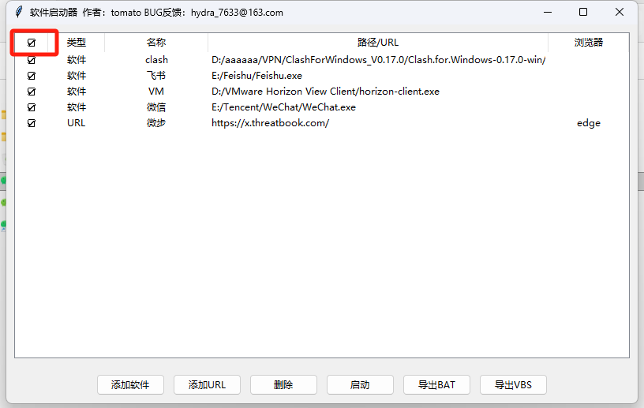
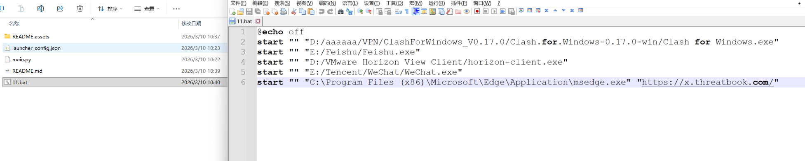
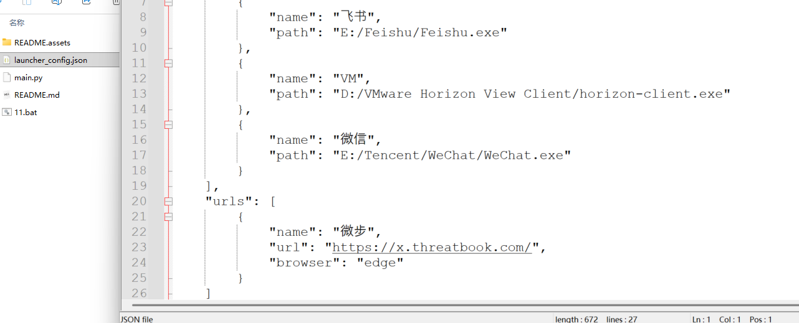

# Batch_launch_of_software_URLs

Windows电脑每天都得关机，第二天得打开一堆的url和程序，本脚本意在解决这个问题，批量打开软件和url，并含有导出为windows一键执行脚本bat和vbs。

# 1、添加软件

点击添加软件

找到软件所在目录，点击软件的exe，点击打开

输入软件名称，此名称是软件的脚本备注，不对软件造成影响

# 2、添加URL

点击添加URL

输入名称、URL和打开URL的浏览器，default是电脑默认浏览器

# 3、启动

第一列是全选按钮，选择可以全选/全不选软件和URL，再点击启动即可启动软件、打开URL

# 4、导出

选中要导出的软件和URL，点击导出BAT或VBS，选择保存位置

双击保存的BAT/VBS，即可打开导出的软件、URL，有代码功底可自行修改

# FAQ

## 目前存在问题：

已经保存了的软件、URL，要修改打开方式/名称，只能删除重新添加，或修改配置文件

